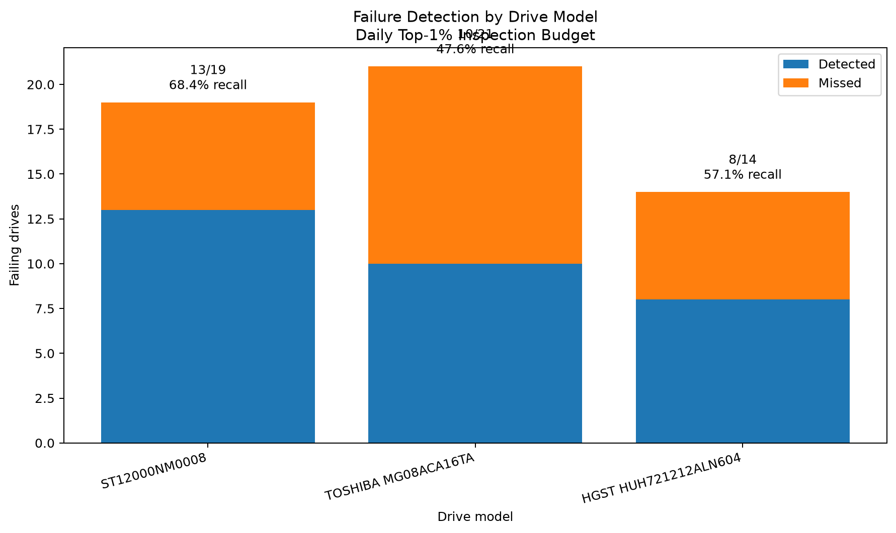
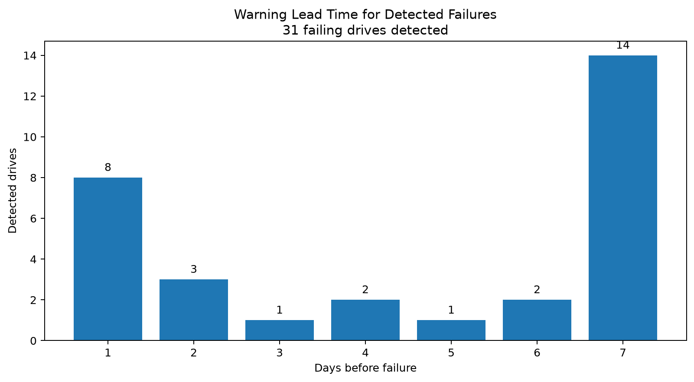
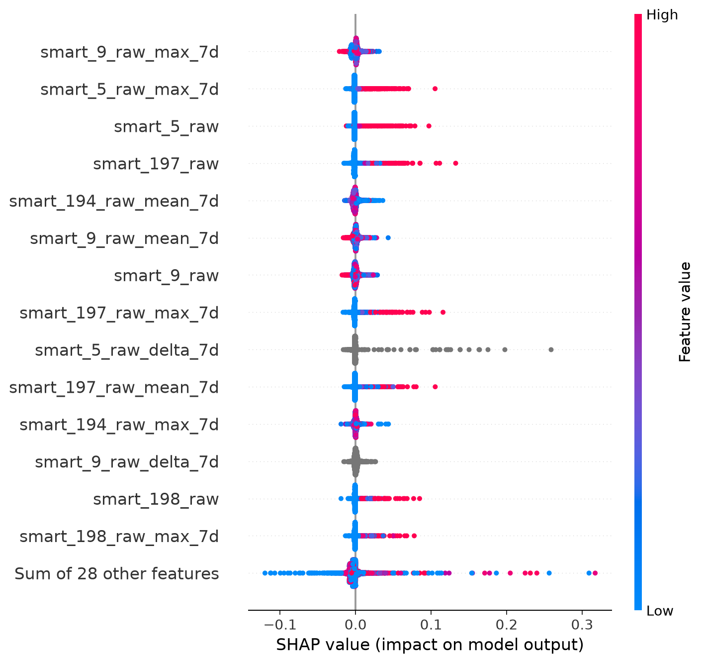
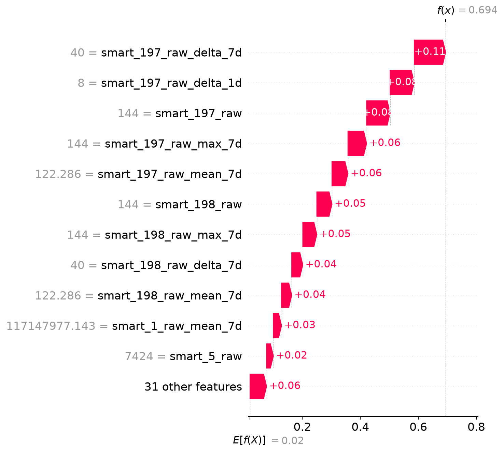
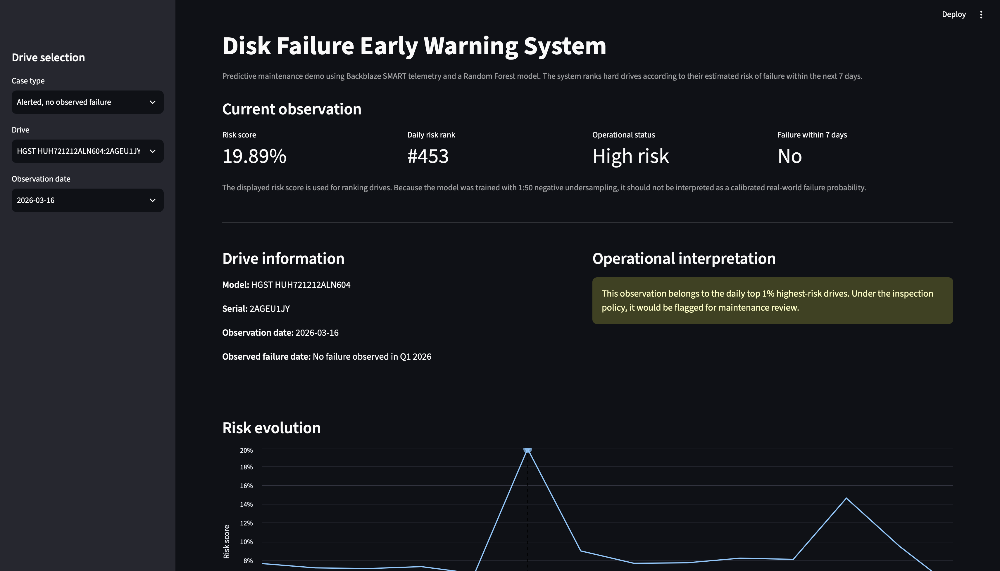

# Backblaze Disk Failure Prediction

Predictive maintenance pipeline for identifying hard drives at elevated risk of failure using historical SMART telemetry from the **Backblaze Drive Stats** dataset.

The project is designed as an end-to-end machine learning workflow: raw drive telemetry is filtered and transformed into time-aware features, models are trained using leakage-safe temporal splits, and predictions are evaluated under a realistic **daily inspection budget**.

---

## Overview

Hard drive failures are rare events, making this a highly imbalanced classification problem.

In a real infrastructure environment, however, the goal is not simply to maximize classification accuracy. An operations team has limited capacity and cannot inspect every drive that receives a non-zero failure probability.

The more useful question is:

> **If only a small fraction of the fleet can be inspected each day, how many drives that are about to fail can the model identify in advance?**

This project therefore focuses on **risk ranking**, early-warning detection and operational evaluation.

The final selected model is a **Random Forest classifier** that predicts whether a healthy drive will have a **recorded failure event within the next 7 days**.

Predictions are converted into alerts using a **daily top-1% fleet-wide policy**, where only the highest-risk 1% of drives evaluated on each day are flagged for inspection.

---

## Key results

* **57.4%** of failing drives detected
* **31 of 54** failing drives identified
* **1%** daily inspection budget
* **6 days** median warning time
* **0.8533** ROC-AUC
* **947,283** drive-day observations in the held-out test set

> **The model detected more than half of the drives with recorded failure events while restricting daily inspections to approximately 1% of the evaluated fleet.**

---

## Dataset

The project uses the public [Backblaze Drive Stats](https://www.backblaze.com/cloud-storage/resources/hard-drive-test-data) dataset.

Backblaze publishes daily SMART telemetry for hundreds of thousands of hard drives deployed in its storage infrastructure.

Each drive-day observation contains information such as:

* date
* serial number
* hard drive model
* failure indicator
* SMART attributes reported by the drive

The full historical dataset contains hundreds of millions of observations, so this project works with a controlled subset of high-volume drive models and a fixed temporal window to keep local experimentation computationally practical.

### Selected drive models

The current experiment focuses on:

* `ST12000NM0008`
* `TOSHIBA MG08ACA16TA`
* `HGST HUH721212ALN604`

The resulting Q1 2026 subset contains approximately **6.1 million drive-day observations across 68,000+ drives**.

This provides observations from multiple hardware families while maintaining enough drive-days and recorded failure events for meaningful evaluation.

---

## Methodology

### Prediction target

The task is formulated as a **7-day failure prediction problem**.

For every healthy drive observation on date `t`, the target `failure_next_7d` is defined as:

* `1` if the drive has a recorded failure event within the following 7 days;
* `0` otherwise.

The recorded failure day itself is excluded from the modeling dataset.

```text id="wx4vc6"
Observation date                    Recorded failure
      │                                   │
      ▼                                   ▼
──────●─────●─────●─────●─────●─────●─────●──────► time
      └──────────── 7-day horizon ─────────┘

      failure_next_7d = 1
```

The model must therefore identify elevated risk **before the recorded failure event occurs**.

### SMART signals

Eight raw SMART attributes are used as the core telemetry signals:

| SMART attribute | General signal                     |
| --------------- | ---------------------------------- |
| SMART 1         | Raw read error rate                |
| SMART 5         | Reallocated sector count           |
| SMART 7         | Seek error rate                    |
| SMART 9         | Power-on hours                     |
| SMART 194       | Temperature                        |
| SMART 197       | Current pending sector count       |
| SMART 198       | Offline uncorrectable sector count |
| SMART 199       | UDMA CRC error count               |

The pipeline does not rely only on the current value of each attribute. It also captures how the signal evolves over time.

### Feature engineering

For every SMART attribute, five representations are generated:

```text id="st6lnk"
current raw value
1-day change
7-day change
7-day rolling mean
7-day rolling maximum
```

Two additional features indicate whether enough historical information is available:

```text id="tl540l"
has_1d_history
has_7d_history
```

This produces:

```text id="rwf21j"
8 SMART attributes × 5 representations = 40
2 history indicators                    =  2
                                             ──
Total model features                    = 42
```

The objective is to capture both the **current state of the drive** and recent changes that may indicate progressive degradation.

---

## Temporal validation strategy

Random row-level splitting is intentionally avoided.

Daily observations from the same hard drive are strongly correlated. Randomly distributing those observations between training and evaluation could expose the model to temporally adjacent states of the same drive and result in overly optimistic performance estimates.

The project instead uses chronological train, validation and test periods.

### Model selection

```text id="txn0z8"
TRAIN
2026-01-01 ─────────────────── 2026-02-21

                 7-day purge

VALIDATION
2026-03-01 ───────── 2026-03-10
```

The validation period is used for model comparison and hyperparameter selection.

### Final evaluation

After model selection, the training window is expanded:

```text id="2g5j23"
FINAL TRAIN
2026-01-01 ───────────────────────── 2026-03-03

                            7-day purge

TEST
2026-03-11 ─────────────── 2026-03-24
```

The final test period remains unseen during model selection.

---

## Preventing temporal leakage

The prediction label itself uses information from the following seven days.

Without an additional temporal gap, an observation close to the end of training could receive its label from a recorded failure event occurring during the validation or test period.

The project therefore introduces a **7-day temporal purge** between training and evaluation.

For the final evaluation:

```text id="8w10ud"
Final training ends
2026-03-03

Purged period
2026-03-04 → 2026-03-10

Test begins
2026-03-11
```

The purge duration matches the prediction horizon, ensuring that training labels are fully resolved before the evaluation period begins.

---

## Handling class imbalance

Recorded drive failures are extremely rare compared with normal drive-day observations.

The training pipeline therefore:

* keeps **all positive observations**;
* deterministically samples negative observations;
* uses a ratio of **1 positive : 50 negatives**.

The validation and test datasets are not undersampled, so reported evaluation results reflect the natural class imbalance of the original data.

A fixed random seed is used for reproducibility:

```python id="nkbel1"
random_state = 42
```

---

## Model selection

Several classification approaches were explored during development:

* Logistic Regression
* LightGBM
* Random Forest

The final selected model is a **Random Forest classifier**:

```python id="qey7zg"
RandomForestClassifier(
    n_estimators=500,
    max_depth=None,
    min_samples_leaf=5,
    max_features="sqrt",
    random_state=42,
    n_jobs=-1,
)
```

The model outputs a continuous `risk_score` for every drive-day observation.

The system uses this score primarily for **ranking drives by risk**, rather than applying a fixed classification threshold such as `0.5`.

---

## Daily alert policy

The model is evaluated under an explicit operational constraint:

> **Only the highest-risk 1% of drives evaluated each day can generate an alert.**

For each evaluation date:

1. every available drive receives a `risk_score`;
2. drives are ranked together from highest to lowest predicted risk;
3. the daily alert budget is calculated as 1% of that day's evaluated fleet;
4. only drives inside that budget are flagged.

At least one drive can be alerted on each evaluation day.

```text id="1rd7lg"
Daily fleet
────────────────────────────────────────────

Model risk ranking

#1   ████████████████████   ALERT
#2   ███████████████████    ALERT
#3   ██████████████████     ALERT
...          top 1%

────────────────────────── alert cutoff

...
#N   ██                     no alert
```

This converts the model from a pure classifier into a **fleet-wide prioritization system**.

---

## Results

The final Random Forest model was evaluated on the held-out test period:

```text id="h7f5kg"
2026-03-11 → 2026-03-24
```

The test set contains **947,283 drive-day observations**, including **199 positive rows** corresponding to observations within seven days of a recorded failure event.

### Overall performance

| Metric                  | Evaluation level |     Result |
| ----------------------- | ---------------- | ---------: |
| ROC-AUC                 | Drive-day        | **0.8533** |
| PR-AUC                  | Drive-day        | **0.0397** |
| Precision               | Drive-day        | **0.0623** |
| Recall                  | Drive-day        | **0.4070** |
| Failing drives          | Drive            |     **54** |
| Detected failing drives | Drive            |     **31** |
| Operational recall      | Drive            |  **57.4%** |
| Daily inspection budget | Fleet            |     **1%** |

ROC-AUC, PR-AUC, precision and recall are calculated at the **drive-day observation level**.

The primary operational metric is:

> **Drive-level recall under a daily top-1% fleet-wide alert budget.**

A failing drive is considered detected when it produces at least one alert within its valid 1-to-7-day pre-failure warning window.

Under this policy, the model identified **31 of 54 failing drives**, corresponding to **57.4% drive-level recall**, while limiting daily inspections to approximately 1% of the evaluated fleet.

Across the test period, the policy generated **9,465 alert observations** involving **1,437 unique drives**.

### Failure detection by drive model



| Drive model          | Failing drives | Detected | Drive recall |
| -------------------- | -------------: | -------: | -----------: |
| ST12000NM0008        |             19 |       13 |    **68.4%** |
| TOSHIBA MG08ACA16TA  |             21 |       10 |    **47.6%** |
| HGST HUH721212ALN604 |             14 |        8 |    **57.1%** |

Performance varies across hardware families.

The Seagate model achieves the highest operational recall, detecting more than two thirds of the drives with recorded failure events.

Within this selected **Q1 2026 test subset**, the HGST model achieves the strongest ROC-AUC despite lower drive-level recall. This illustrates why conventional row-level ranking metrics alone are not sufficient for evaluating a predictive-maintenance system under a constrained operational alert budget.

### Failure warning lead time

For each successfully detected failing drive, lead time is measured using the **earliest alert that falls within the valid 1-to-7-day warning window** before the recorded failure event.



The model achieved:

* **mean warning time:** 4.52 days;
* **median warning time:** 6 days;
* **maximum warning time:** 7 days;
* **14 of 31 detected failures** were identified with the full 7-day warning horizon.

| Days before recorded failure | Detected drives |
| ---------------------------: | --------------: |
|                            1 |               8 |
|                            2 |               3 |
|                            3 |               1 |
|                            4 |               2 |
|                            5 |               1 |
|                            6 |               2 |
|                            7 |              14 |

A substantial proportion of successful alerts occur several days before the recorded failure event rather than immediately beforehand, making them more useful from a maintenance perspective.

---

## Model explainability

SHAP analysis is used at both global and individual prediction levels.

### Global feature behaviour

The SHAP beeswarm plot shows how feature values influence predictions across a sample of test observations.



This provides information about both the **magnitude** and **direction** of individual feature effects.

### Explaining a detected failure

The project also generates a local explanation for a drive that was successfully detected before its recorded failure event.



The waterfall plot decomposes the drive's predicted risk score into the contribution of individual SMART features.

```text id="jsimx6"
SMART telemetry
      ↓
Engineered temporal features
      ↓
Random Forest risk score
      ↓
Daily risk ranking
      ↓
Top-1% alert
      ↓
Recorded failure within 7 days
```

Together, the two SHAP views provide complementary explanations:

* **global SHAP:** which signals generally influence model behaviour;
* **local SHAP:** why a particular drive was considered high risk.

---

## Demo

The project includes a **Streamlit application** for interactively exploring model predictions and the operational alert policy.

The demo uses exported prediction data and the final trained inference pipeline to make the system easier to inspect beyond command-line evaluation.



Launch it locally with:

```bash id="nfvnhg"
streamlit run app/app.py
```


---

## Pipeline

```text id="k1fo3n"
Backblaze Drive Stats
          │
          ▼
      Raw ingestion
          │
          ▼
   Drive-model filtering
          │
          ▼
 Build 7-day failure target
          │
          ▼
   Feature engineering
      42 features
          │
          ▼
    Temporal splitting
          │
    ┌─────┴─────┐
    │           │
 Training     Evaluation
    │           │
1:50 negative   │
undersampling   │
    │           │
    └─────┬─────┘
          ▼
    Model training
          │
          ▼
      Risk scoring
          │
          ▼
 Rank drives each day
          │
          ▼
 Daily top-1% policy
          │
          ▼
 Drive-day metrics
          +
 Drive-level recall
```

---

## Project structure

```text id="fbnzj3"
backblaze-disk-failure/
│
├── app/
│   └── app.py
│
├── data/
│   ├── raw/
│   ├── interim/
│   └── processed/
│
├── models/
│
├── reports/
│   └── figures/
│
├── src/
│   ├── ingestion/
│   ├── features/
│   ├── modeling/
│   └── evaluation/
│
├── tests/
│
├── pyproject.toml
├── README.md
└── .gitignore
```

### Main modules

`src/ingestion/`
Handles raw Backblaze data exploration and creation of the selected-model dataset.

`src/features/`
Builds the 7-day failure target, engineered SMART features and temporal split diagnostics.

`src/modeling/`
Contains dataset loading utilities, model training, tuning, inference and model export.

`src/evaluation/`
Contains final evaluation, performance breakdowns, alert-policy logic and explainability utilities.

`app/`
Contains the Streamlit interface for exploring final model predictions and alerts.

---

## Reproducibility

Important reproducibility decisions include:

* fixed temporal boundaries;
* explicit 7-day leakage purge;
* deterministic negative undersampling;
* fixed random seed;
* centralized feature configuration;
* centralized model parameters;
* reusable alert-policy logic;
* automated tests;
* CI checks;
* modular training and evaluation scripts.

Configuration is centralized in:

```text id="6ozobv"
src/config.py
```

This includes:

* selected drive models;
* SMART attributes;
* feature definitions;
* prediction horizon;
* train/validation/test periods;
* undersampling ratio;
* alert budget;
* model hyperparameters.

---

## Running the project

### 1. Create the environment

```bash id="prkrmf"
python -m venv .venv
source .venv/bin/activate
```

### 2. Install the project and development dependencies

```bash id="n0313a"
pip install -e ".[dev]"
```

### 3. Run the test suite

```bash id="exl29c"
pytest -q
```

### 4. Run the pipeline

```bash id="be7fks"
python -m src.pipeline
```

### 5. Run the final evaluation

```bash id="b3gbgf"
python -m src.evaluation.evaluate_random_forest_final
```

### 6. Evaluate performance breakdowns

```bash id="v8h0ju"
python -m src.evaluation.evaluate_breakdowns
```

### 7. Launch the Streamlit demo

```bash id="m9h6qq"
streamlit run app/app.py
```

---

## Tech stack

* **Python**
* **pandas**
* **DuckDB**
* **scikit-learn**
* **LightGBM**
* **SHAP**
* **Streamlit**
* **Altair**
* **Parquet**
* **pytest**
* **Ruff**
* **GitHub Actions**
* **Git / GitHub**

---

## Engineering decisions

### Why DuckDB and Parquet?

The original Backblaze dataset contains hundreds of millions of drive-day observations.

DuckDB enables efficient analytical queries without requiring a separate database server, while Parquet provides compressed columnar storage and fast access to intermediate datasets.

### Why temporal evaluation?

SMART observations from the same drive evolve over time and are highly correlated.

A random split could put nearby observations from the same physical drive into both training and evaluation, producing optimistic results. Chronological evaluation better represents future deployment.

### Why a 7-day horizon and purge?

The goal is early warning rather than same-day failure detection.

Because the target looks seven days ahead, a matching seven-day purge is used between training and evaluation to prevent labels from crossing temporal boundaries.

### Why a daily top-1% policy?

Predictive maintenance has an operational cost.

A model that identifies many failures but requires inspecting a large fraction of the fleet would be difficult to use in practice. The 1% policy introduces an explicit maintenance-capacity constraint.

### Why evaluate drive models separately?

SMART behaviour is not perfectly standardized across hardware families.

Per-model evaluation reveals performance differences that would otherwise be hidden inside a single aggregate score.

---

## Limitations

* Recorded failure events remain rare even in very large telemetry datasets.
* SMART behaviour differs across manufacturers and drive models.
* The current experiment covers a limited Q1 2026 temporal window.
* The fixed 1% alert budget does not explicitly model maintenance costs.
* The model predicts **failure events recorded by Backblaze**, not necessarily every possible form of physical drive degradation.
* Results should not be interpreted as general performance guarantees across all drive models or time periods.

---

## Possible extensions

Future work could include:

* additional drive models;
* longer historical training windows;
* rolling backtesting;
* probability calibration;
* cost-sensitive learning;
* model-specific alert thresholds;
* alternative prediction horizons;
* survival analysis;
* fleet-level drift monitoring;
* automated experiment tracking;
* batch inference deployment.

---

The project is intended as a reproducible predictive-maintenance workflow rather than a standalone modeling experiment: **large-scale telemetry processing, leakage-aware temporal validation, operational risk ranking and interpretable failure alerts are treated as parts of the same system.**
